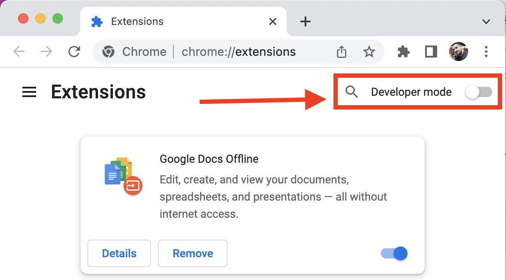
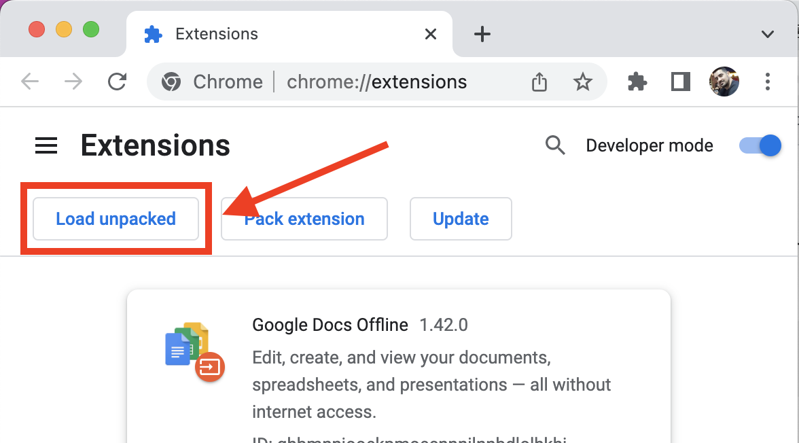
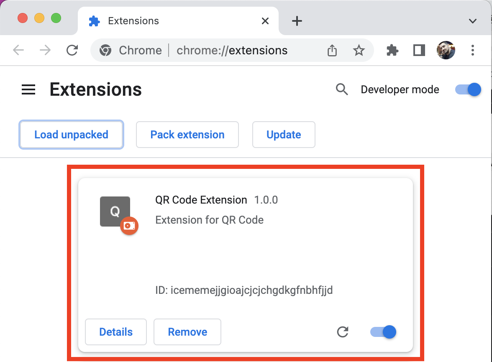

# Flutter QR Code generator chrome extension

To build the extension run the following command:

`flutter build web --web-renderer html --csp`

You will find the generated files inside `build/web` folder present in your root Flutter project directory.

To install and use this extension, go to this URL from the Chrome browser:

`chrome://extensions`

To install the extension:

- Enable the **Developer mode** toggle present in the top-right corner of the webpage.

- Click **Load unpacked**.

- Select the `<flutter_project_dir>/build/web` folder.

